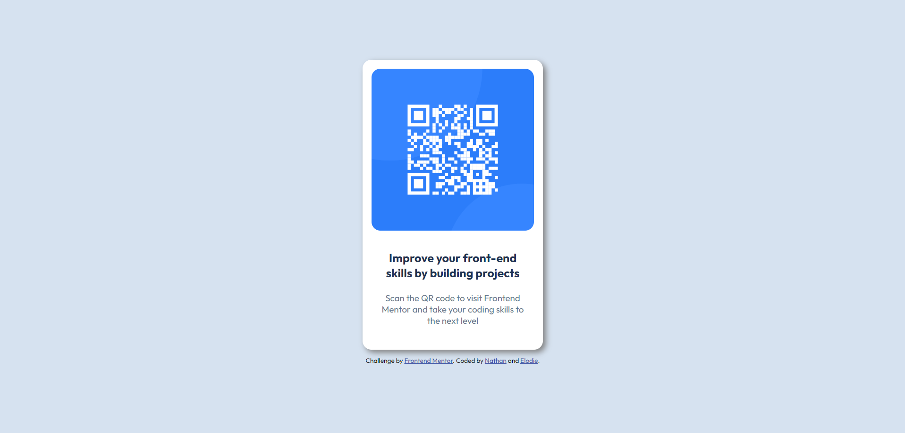

# Frontend Mentor - QR code component solution

This is a solution to the [QR code component challenge on Frontend Mentor](https://www.frontendmentor.io/challenges/qr-code-component-iux_sIO_H). Frontend Mentor challenges help you improve your coding skills by building realistic projects.

## Table of contents

-   [Overview](#overview)
    -   [Screenshot](#screenshot)
    -   [Links](#links)
-   [Our process](#our-process)
    -   [Built with](#built-with)
    -   [What I learned](#what-i-learned)
-   [Author](#author)

**Note: Delete this note and update the table of contents based on what sections you keep.**

## Overview

The goal of this project was to manipulate CSS and HTML to display a QR code to scan, and make it simple, beautiful, accessible and responsive.

### Screenshot



### Links

-   Solution URL: [Add solution URL here](https://your-solution-url.com)
-   Live Site : [Vercel App](https://qr-code-component-six-xi.vercel.app/)

## Our process

-   Create boxes to contain both image and text, and a larger one which will be at the center of the screen
-   Center every elements inside their respectives boxes
-   Center boxes
-   Add finishing touches like fonts, border radius, colors...

### Built with

-   Semantic HTML5 markup
-   CSS custom properties
-   Flexbox

### What I learned

-   CSS is really just boxes that we create and customize as we wish
-   It's possible to make a element size sensible to which size the screen is, instead of just doing it with percentage :

```css
@media (max-width: 500px) {
    .container {
        max-width: 250px;
        width: 90%;
    }
}
```

## Author

-   Linkedin - [Nathan CAZARD](https://www.linkedin.com/in/nathan-cazard-431879180/)
-   Frontend Mentor - [@nathanc8](https://www.frontendmentor.io/profile/nathanc8)
